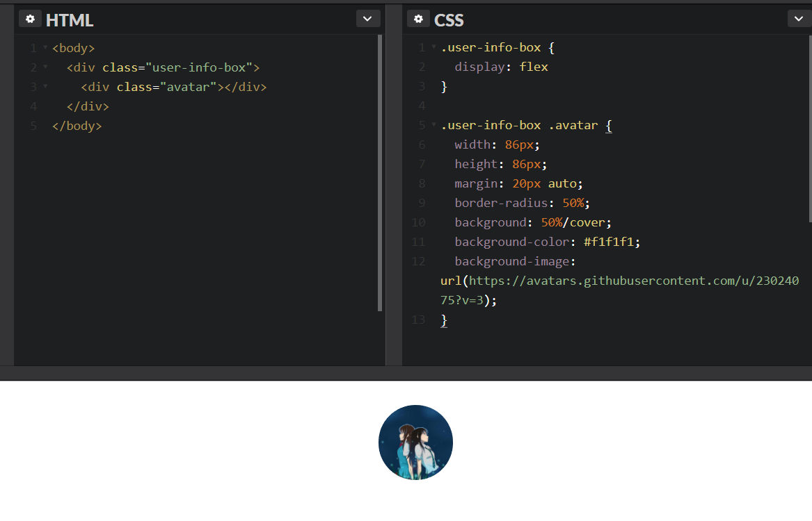

# CSS / CSS3 的踩坑与应用

css 的学习曲线可以说是非常奇怪了.. 说简单, 的确来个人认真的学习三五天, 也能跟着模仿, 撸出一个像样的页面. 但是说复杂, 的确又是挺复杂的, 各个属性之间的耦合性让人防不胜防. 下面将自己的一些经验分享下.

---

### 目录

* CSS 及常见的应用
  1. [reset 与 Normalize](#reset)
  1. [隐藏元素](#dispaly)
  1. [常见的居中](#center)
  1. [图片居中处理](#imgage)
  1. [文字超出显示省略号(text-overflow)](#text-overflow)
  1. [响应式设计 - 针对不同分辨率设置(@media)](#responsive)
* CSS3
  - [留坑]

---

### reset 与 Normalize

<a name="reset"></a>

可能有同学会困惑, 这两者有什么区别, 该如何取舍. 我曾经写过一篇博客, . 有兴趣的同学可以过去看一下 - [浅谈 Normalize 与 reset](https://anran758.github.io/blog/2017/10/15/%E6%B5%85%E8%B0%88Normalize%E4%B8%8Ereset/)

**优化后的`reset.css`**: https://github.com/anran758/Front-End-Lab/tree/master/CSS/reset.css

---

#### 隐藏元素

<a name="display"></a>

优化无障碍的体验, `display: none`辅助屏幕设备实际上是读不了的。

```css
.hidden {
  position: absolute;
  top: -9999em;
}

.hidden {
  position: absolute;
  clip: rect(1px 1px 1px 1px); /* IE6, IE7 */
  clip: rect(1px, 1px, 1px, 1px);
}
```

如果不用顾忌无障碍的话, 也可以这个方法来避免页面回流

```css
.hidden {
  position: absolute;
  visibility: hidden;
}
```

---

#### 文字超出显示省略号(text-overflow)

<a name="text-overflow"></a>

text-overflow 只是用来说明文字溢出时用什么方式显示，要实现溢出时产生省略号的效果，还须配合其他属性.

```css
/* 强制不断行, 单行超出范围出现省略号 */
.overflow {
  overflow: hidden;
  white-space: nowrap;
  text-overflow: ellipsis;
}
```

#### 图片居中裁剪
<a name="imgage"></a>

我们经常能遇到这种情景, 做一个用户头像. 拿到的图片是一个长方形的长图, 但是我们并不需要这么长的图, 因此我们需要"裁剪". 这时我们只需设置图片中心为原点, 设置相应的宽高再加上圆角即可, 代码如下:
``` css
.user-info-box .avatar {
  width: 86px;
  height: 86px;
  border-radius: 50%;
  background: 50%/cover;
  background-color: #f1f1f1;
  background-image: url(https://avatars.githubusercontent.com/u/23024075?v=3);
}
```
[点击测试/codeopen](https://codepen.io/anran758/pen/WdOvRY)  
其中`background: 50%/cover`是关键, 这一个方法同时也可以适用于其他有图片的场景.



#### 响应式设计 - 针对不同分辨率设置(@media)

<a name="responsive"></a>

如今比较通用的媒体查询. 其中`max-width`是媒体查询的一个特性，其意思是指媒体类型小于或等于指定的宽度时, `min-width`相反

```css
/* 1024px显屏 */
@media screen and (max-width: 1024px) {
  /* 样式代码 */
}

/* 800px显屏 */
@media screen and (max-width: 800px) {
}

/* 640px显屏 */
@media screen and (max-width: 640px) {
}

/* iPad横板显屏 */
@media screen and (max-device-width: 1024px) and (orientation: landscape) {
}

/* iPad竖板显屏 */
@media screen and (max-device-width: 768px) and (orientation: portrait) {
}

/* iPhone 和 Smartphones */
@media screen and (min-device-width: 320px) and (min-device-width: 480px) {
}
```

现在有关于这方面的运用也是相当的成熟，twitter 的 Bootstrap 第二版本中就加上了这方面的运用。大家可以对比一下：

```css
@media (max-width: 480px) {
  ...;
}
@media (max-width: 768px) {
  ...;
}
@media (min-width: 768px) and (max-width: 980px) {
  ...;
}
@media (min-width: 1200px) {
  ..;
}
```
